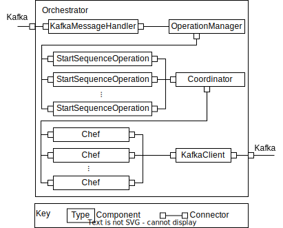
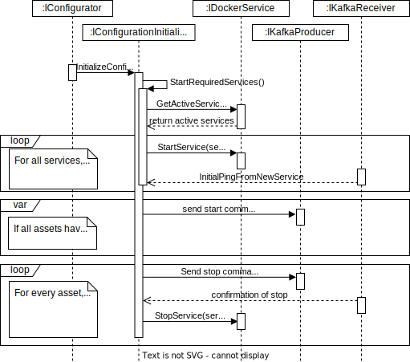

# A Reconfigurable Industry 4.0 Middleware Software Architecture
Initial description...

## Documentation

### Class Diagrams

#### Orchestrator

#### Configurator

#### Generic Service

### Allocation View
Description of allocation view...

### Component and Connector View
#### Orchestrator

#### Configurator

#### GenericService

### Activitiy Diagrams

#### Orchestrator: Production process

#### Configurator: Prepare for initializatin

#### Configurator: Initialize configuration

#### Generic Service: Initialization of service

#### Generic Service: Normal production flow
