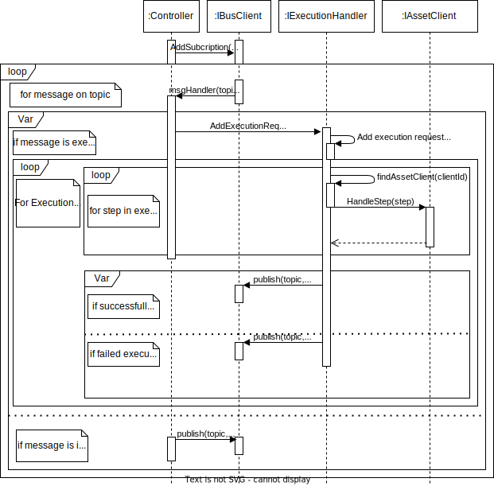

# A Reconfigurable Industry 4.0 Middleware Software Architecture
This repository is used as an extension to the documentation provided in Paper X. The primary purpose is to explain the functionality of the system and the structure of the code base found in in the /src folder. The ensuing sections are subdivided as follows:
1. Brief description and ToC of the source code in the /src folder.
2. Guide on how to build the project using command line tools
3. Documentation of the code, subdivided into Class Diagrams, Component and Connector Views and Sequence Diagrams.

## Content Overview

The /src folder is structured based on the dotNet structure, i.e. containing an overall solution-file that can be loaded using Visual Studio, JetBrains Rider or a similar IDE. The solution file is responsible for managing the projects built in the dotnet environment, i.e. the Configurator, GenericAAS, Orchestrator and the Toolchain library used by the other projects. Each project is in their own sub folder.
Additionally, the /src folder contains the configuration files for the kafka and logging infrastructure. The kafka folder contains the docker-compose file responsible for starting the kafka broker, the zookeeper instance and a Kowl instance, as well as a python kafka-client to act as the software driver and issue orders to the system.
The logging folder contains the docker-compose file used to start elastic search, kibana and a kafka-connect instance.

Using the provided code, it is possible to build and run the dotnet projects and start the kafka and logging infrastructure, but no meaningful results can be extracted, as the different components require external tools like an MQTT or OPCUA Broker. These tools are not provided in this repository as it does not add value to the runtime results without also having access to equipment that interact with tools on the other side, i.e. production cells or the magnetic transport track.

The documentation for the system modules is provided in the /docs folder. The following overview describes how the documentation is related to the software modules.
- ReconfigurableI4MiddlewareSoftwareArchitecture
  - General System
    - [Allocation View](#allocation-view)
  - Configurator
    - [Module Diagram](#configurator-class-diagram)
    - [Component and Connector Diagram](#configurator-cc)
    - [Sequence Diagram of prepare process](#configurator---prepare-for-initialization)
    - [Sequence Diagram of initialization process](#configurator---initialize-configuration)
  - GenericAAS
    - [Module Diagram](#generic-service-class-diagram)
    - [Component and Connector Diagram](#generic-service-cc)
    - [Sequence Diagram of production process](#generic-service---normal-production-flow)
  - Kafka
    - Includes a docker-compose file, that is used to start the Kafka setup, including a Kafka broker, a Zookeeper instance and a Kowl instance.
  - Logging
    - Includes a docker-compose file that is used to start the logging stack, including and instance of elasticsearch and kibana, an instance of kafka connect including a plugin for elasticsearch.
  - Orchestrator
    - [Module Diagram](#orchestrator-class-diagram)
    - [Component and Connector Diagram](#orchestrator-cc)
    - [Sequence Diagram of production process](#orchestrator-production-process)
  - Toolchain
    - Enacts a library to reuse code in relation to kafka communication.

## Build guide
The following guide describes the prequisits and process for building and interacting with the project.
### Prerequisits
The following prerequisits are required to build the project.
- The .Net SDK must be installed, see official guide: [Guide](https://docs.microsoft.com/en-us/dotnet/core/install/windows?tabs=net60)
- This repository must be downloaded.

### Build
To build the project, execute the following steps.
- Open the CLI inside the root folder of this repository.
- Use the following command to build the respective project:
  - Configurator
    - *dotnet build ./src/ReconfigurableI4MiddlewareSoftwareArchitecture/Configurator*
  - GenericAAS
    - *dotnet build ./src/ReconfigurableI4MiddlewareSoftwareArchitecture/GenericAAS*
  - Orchestrator
    - *dotnet build ./src/ReconfigurableI4MiddlewareSoftwareArchitecture/Orchestrator*

## Documentation

### Class Diagrams
The purpose of the following class diagrams is to provide an overview of the functionality of the system and the structure of the code base. For each view, both a coarse and a fine grained view are presented.
The notation of the coarse grained view is based on the "uses" style presented by Documenting Software Architecture.
The notation of the fine grained view is based on UML, including both the "uses" style and the generalization style presented in Documenting Sofware Architecture
For each class diagram, an Element catalogue is provided to describe the individual elements.
#### **Orchestrator Class Diagram**
***Coarse grained view***

The following figure shows the coarse grained module view of the Orchestrator.
The purpose of the DataModel is to define the structure of an Order and provide access to a Recipe.
The Order is responsible for Product information.
It includes type, how many to produce, and the Recipe for producing a Product. 
The Recipe defines how a Product should be produced, i.e. the product ID and a list of required steps to produce the Product. 
A Step in a Recipe defines the required interaction with a Service by describing a request and an expected response.
For instance, the request defines where the request should be sent to, and the response defines what the response should contain.
The Product is responsible for containing all the information for a single Product, including the current status and the production logs. 

The purpose of the Coordination module is to organize the communication flow between services.
The responsibility of the ICoordinator is to manage the queue of orders and coordinate the execution of an Order, i.e. managing the IChef implementations. 
The IChef is responsible for handling the production of a single Product based on a Recipe.
The Coordination module imports the DataModel module to access information about the Order to produce the product.
The Coordination module uses the BusCommunication module to interact with the message bus and the RecipeInterpretation module to interpret recipes when required.

The purpose of the RecipeInterpretation module is to interpret recipes from a file or a message received from the message bus. 
It enables applications from the business layer, e.g. ERP or MES, to send order requests with a Recipe for the products.
The RecipeInterpretation module imports the DataModel module to access Recipe data and translate files or messages to Recipe objects.

***Fine grained view***

The following figure shows the fine grained, i.e. more detailed view of the previous Orchestrator module view. Additionally, it shows how the I4ToolchainDotNetCore library is used in connection with the orchestrator. Below the diagram, a description for each element can be found in the element catalogue.

***Element catalogue***
| Level 1 | Level 2 | Level 3 | Level 4 | Description |
|---|---|---|---|---|
| I4ToolChainDotnetCore | IKafkaMessageHandler |  |  | Responsible for handling all the incomming kafka messages |
|  | IKafkaReceiver |  |  | Responsible for receiving messages from multiple topics, the client can subscribe to multiple topics at once, add new ones and remove them again |
|  | IOperationManager |  |  | Responsible for managing an incoming operation request, i.e. finding the right IOperation implementation matching the requested operation and initializing the execution. |
|  | Message |  |  | Describing the general message structure used to communicate over the message bus. |
|  | IOperation |  |  | Responsible for executing an operation, typically implemented by multiple implementations to facilitate multiple operations that can be created and executed (Only used by the Orchestrator) |
|  | IKafkaProducer |  |  | Responsible for sending messages to one or more specified topics |
| I4-Orchestrator-DotnetCore | Program |  |  | Responsible for initializing the application and setup dependency injection |
|  | Service | IConfigurationHandler |  | The IConfigurationHandler is not used in the setup deployed for the use case study |
|  |  | StartSequenceOperation |  | Responsible for handling the operation related to executing an order, i.e. sending an order execution request to the ICoordinator and once completed or failed respond to the original order issuer via kafka. |
|  |  | ResetSequenceOperation |  | Not used in the setup deployed for the use case study |
|  | DomainModel | Order |  | Responsible for containing all information related to an order, as well as pushing events to subscribers using provided methods. Subscribers can subscribe to completion or failure of the order. |
|  |  | Product |  | Responsible for containing all information related to a product, as well as pushing events to subscribers using provided methods. Subscribers can subscribe to completion or failure of the product. |
|  |  | CapabilityResponseMessage |  | Defining the message structure used for messages coming from the configurator via kafka to notify the orchestrator of a configuration that is ready to be initialized |
|  |  | AvailabilityNotification |  | Message type used internally to notify the orchestrator that one of the chefs is avaiable again and thus ready to produce another product |
|  |  | CapabilityRequestMessage |  | Defining the message structure used for messages to the configurator via kafka to request a configuration for a set of capabilities. |
|  |  | CapabilitiesReadyMessage |  | Defining the message structure used for messages coming from the configurator via kafka to notify the orchestrator that the requested configuration is initialized |
|  | Adapter | ICoordinator |  | Responsible for managing the execution of an Order, i.e. managing the individual chefs and coordinating the production of all products required to fulfil the order. |
|  |  | ICookbook |  | Responsible for storing and providing access to recipes |
|  |  | IChef |  | Responsible for producing a product based on the defined recipe. While executing the individual steps, the product is updated to enable future traceability. |
|  |  | INotifier |  | THe INotifier is not used in the execution of this use case study |
|  |  | RecipeInterpretation | Recipe | Responsible for defining all setps required to produce a product. |
|  |  |  | Step | A step defines both the topic to send a command to, the command and the expected response if the command has been executed successfully. |
|  |  |  | Command | Defines the target of the command, the operation/capability to be executed and if required also parameters |
|  |  |  | Response | Defines the parameters expected in the response, typically "success" with a boolean value. |
|  |  |  | RecipeInterpreter | Responsible for converting json data to recipes. |
|  |  | Kafka | IKafkaMultiConsumer | Responsible for the handling the subscription to multiple kafka topics |
|  |  | KafkaMessage |  | Used for internal message flow in connection with the IObservable pattern implemented in C#. Subscribers are subscribing to the topics using the IKafkaMulticonsumer to centralze the kafka subscription. |
|  |  | KafkaUnsubscriber |  | Used in connection with the IObservable pattern implemented in C# to unsubscribe to topics |

<!-- - I4ToolChainDotnetCore
  - IKafkaMessageHandler
    - Responsible for handling all the incomming kafka messages
  - IKafkaReceiver
    - Responsible for receiving messages from multiple topics, the client can subscribe to multiple topics at once, add new ones and remove them again
  - IOperationManager
    - Responsible for managing an incoming operation request, i.e. finding the right IOperation implementation matching the requested operation and initializing the execution.
  - Message
    - Describing the general message structure used to communicate over the message bus.
  - IOperation
    - Responsible for executing an operation, typically implemented by multiple implementations to facilitate multiple operations that can be created and executed (Only used by the Orchestrator)
  - IKafkaProducer
    - Responsible for sending messages to one or more specified topics
- I4-Orchestrator-DotnetCore
  - Program
    - Responsible for initializing the application and setup dependency injection
  - Service
    - IConfigurationHandler
      - The IConfigurationHandler is not used in the setup deployed for the use case study
    - StartSequenceOperation
      - Responsible for handling the operation related to executing an order, i.e. sending an order execution request to the ICoordinator and once completed or failed respond to the original order issuer via kafka.
    - ResetSequenceOperation
      - Not used in the setup deployed for the use case study
  - DomainModel
    - Order
      - Responsible for containing all information related to an order, as well as pushing events to subscribers using provided methods. Subscribers can subscribe to completion or failure of the order.
    - Product
      - Responsible for containing all information related to a product, as well as pushing events to subscribers using provided methods. Subscribers can subscribe to completion or failure of the product.
    - CapabilityResponseMessage
      - Defining the message structure used for messages coming from the configurator via kafka to notify the orchestrator of a configuration that is ready to be initialized
    - AvailabilityNotification
      - Message type used internally to notify the orchestrator that one of the chefs is avaiable again and thus ready to produce another product
    - CapabilityRequestMessage
      - Defining the message structure used for messages to the configurator via kafka to request a configuration for a set of capabilities.
    - CapabilitiesReadyMessage
      - Defining the message structure used for messages coming from the configurator via kafka to notify the orchestrator that the requested configuration is initialized
  - Adapter
    - ICoordinator
      - Responsible for managing the execution of an Order, i.e. managing the individual chefs and coordinating the production of all products required to fulfil the order.
    - ICookbook
      -  Responsible for storing and providing access to recipes
    - IChef
      - Responsible for producing a product based on the defined recipe. While executing the individual steps, the product is updated to enable future traceability.
    - INotifier
      - THe INotifier is not used in the execution of this use case study
    - RecipeInterpretation
      - Recipe
        - Responsible for defining all setps required to produce a product.
      - Step  
        - A step defines both the topic to send a command to, the command and the expected response if the command has been executed successfully.
      - Command
        - Defines the target of the command, the operation/capability to be executed and if required also parameters
      - Response
        - Defines the parameters expected in the response, typically "success" with a boolean value.
      - RecipeInterpreter
        - Responsible for converting json data to recipes.
    - Kafka
      - IKafkaMultiConsumer
        - Responsible for the handling the subscription to multiple kafka topics
      - KafkaMessage
        - Used for internal message flow in connection with the IObservable pattern implemented in C#. Subscribers are subscribing to the topics using the IKafkaMulticonsumer to centralze the kafka subscription. 
      - KafkaUnsubscriber
        - Used in connection with the IObservable pattern implemented in C# to unsubscribe to topics. -->

#### **Configurator Class Diagram**
***Coarse grained view***
The following figure shows the coarse grained module view of the Configurator.
%The DataModel module's purpose is to define the data classes and provide access to the required data.
%The DataModel provides access to the CapabilitySet, which is responsible for describing sets of capabilities.
The DataModel provides access to the CapabilitySet, which defines capability sets for the system.
It also provides access to the AssetCapabilityMapping that defines what capabilities are available per asset.

The purpose of the ConfigurationManagement module is to handle the stages: 1) finding configurations, 2) assessing and mapping the configurations, and 3) initializing a configuration.
The IConfigurator is responsible for the management of the process, i.e. enabling the transition from one stage to the other. 
The IConfigurationFinder is responsible for finding capability sets based on the requested capabilities in stage 1.
The IConfigurationAssessor and ConfigurationMapper are responsible for stage 2, i.e. assessing the capabaility sets that have been found and map a capability to an asset.
The IConfigurationInitializer is responsible for initializing the assets that have been chosen in the previous stage using the ContainerManagement module in stage 3.
The ConfigurationManagement module imports the DataModel module to access the CapabilitySet and the AssetCapabilityMapping functionality. 
ConfigurationManagement uses the BusCommunication module to interact with the message bus and the ContainerManagement module to manage services.

The purpose of the ContainerManagement module is to manage the lifetime of services.
IContainerService is responsible for asynchronously starting and stopping the services, i.e. creating, starting, and stopping containers.
In this case study, Docker is implemented for container management, indicated by the DockerService module.
The services are started asynchronously to minimize the time required for starting a configuration with multiple services.

***Fine grained view***

The following figure shows the fine grained, i.e. more detailed view of the previous Configurator module view. Below the diagram, a description for each element can be found in the element catalogue.

***Element catalogue***

| Level 1 | Level 2 | Level 3 | Description |
|---|---|---|---|
| ConfigurationManagement | IConfigurator |  | Responsible for managing the entire reconfiguration process, i.e. finding, assessing, mapping and initializing a configuration |
|  | IConfigurationFinder |  | Responsible for finding a list of capability sets matching a list of requested capabilities |
|  | IConfigurationAssessor |  | Responsible for assessing a list of capability sets and choosing the best based on chosen criteria and/or algorithms |
|  | IConfigurationMapper |  | Responsible for mapping capabilities to services, and thus defines what services need to be started in order for the system to be able to fulfil certain capability requests |
|  | IConfigurationInitializer |  | Responsible for initializing a configuration, i.e. one or more services. |
| DataModel | MessageTypes | AssetStartResponse | Message type used by the Services as the initial heartbeat, indicating that they have started successfully |
|  |  | ConfigurationRequest | Message type used by the Orchestrator to request a configuration based on a list of required capabilities |
|  |  | InitializationRequest | Message type used by the Orchestrator to request the initialization of a configuration, i.e. the services required to start the execution of an order. |
|  |  | AssetStopResponse | Message type used by the services to notify the configuator that they are ready to be shut down |
|  |  | ConfigurationResponse | Message type used by the Configurator to notify the orchestrator that a configuration has been found and is ready to be initialized. |
|  | PreparedConfiguration |  | The configuration that has been prepared, i.e. a set of services that can be initialized when requested. The services have been previously been identified based on a set of required capabilities to execute an order |
|  | AssetCapabilityMapping |  | A mapping between a service configuration and the capabilities it is able to fulfill with the service configuration. |
|  | Configuration |  | Not used in connection with this use case study |
|  | ServiceSetupInformation |  | Defines the service configuration, i.e. the serviceId, the location of the bus configuration and the location of the asset configurations. |
|  | CapabilitySet |  | A set of capabilities |
|  | Recipe |  | Not used in connection with this use case study |
|  | Step |  | Not used in connection with this use case study |
| ContainerManagement | IContainerService |  | Responsible for managing the services as docker containers. This includes starting the service with a specified service ID, including the path for the bus configuration and the path for the asset configurations, as well as stopping them again. |
| BusCommunication | KafkaMessageHandler |  | Responsible for handling the messages received via kafka |

<!-- - ConfigurationManagement
  - IConfigurator
    - Responsible for managing the entire reconfiguration process, i.e. finding, assessing, mapping and initializing a configuration.
  - IConfigurationFinder
    - Responsible for finding a list of capability sets matching a list of requested capabilities
  - IConfigurationAssessor
    -  Responsible for assessing a list of capability sets and choosing the best based on chosen criteria and/or algorithms
  - IConfigurationMapper
    - Responsible for mapping capabilities to services, and thus defines what services need to be started in order for the system to be able to fulfil certain capability requests
  - IConfigurationInitializer
    - Responsible for initializing a configuration, i.e. one or more services.
- DataModel
  - MessageTypes
    - AssetStartResponse
      - Message type used by the Services as the initial heartbeat, indicating that they have started successfully
    - ConfigurationRequest
      - Message type used by the Orchestrator to request a configuration based on a list of required capabilities
    - InitializationRequest
      - Message type used by the Orchestrator to request the initialization of a configuration, i.e. the services required to start the execution of an order.
    - AssetStopResponse
      - Message type used by the services to notify the configuator that they are ready to be shut down
    - ConfigurationResponse
      - Message type used by the Configurator to notify the orchestrator that a configuration has been found and is ready to be initialized.
  - PreparedConfiguration
    - The configuration that has been prepared, i.e. a set of services that can be initialized when requested. The services have been previously been identified based on a set of required capabilities to execute an order
  - AssetCapabilityMapping
    - A mapping between a service configuration and the capabilities it is able to fulfill with the service configuration.
  - Configuration
    - Not used in connection with this use case study
  - ServiceSetupInformation
    - Defines the service configuration, i.e. the serviceId, the location of the bus configuration and the location of the asset configurations.
  - CapabilitySet
    - A set of capabilities
  - Recipe
    - Not used in connection with this use case study
  - Step
    - Not used in connection with this use case study
- Docker
  - IDockerService
    - Responsible for managing the services as docker containers. This includes starting the service with a specified service ID, including the path for the bus configuration and the path for the asset configurations, as well as stopping them again.
- BusCommunication
  - KafkaMessageHandler -->
#### **Generic Service Class Diagram**
***Coarse grained view***
The following figure shows the coarse grained module view of a Service. 

The DataModel module's purpose is to define the data classes and provide access to the required data.
The responsibility of the BusConfig is to define the information required to establish a connection to a message bus. 
For instance, enabling the connection to a Kafka broker (example of a message bus) includes the host and port of the running Kafka broker instance and the initial topics to subscribe to. 

The ExecutionFlow is responsible for describing the asset through the AssetConfig and the steps required to invoke a capability. 
Each Step defines the required interaction with the asset, including the parameters to define the expected request and response.
For instance, to initiate a production cell, the first step describes a command and where to publish the command, e.g. a JSON message and a MQTT topic .
The AssetConfig is responsible for defining the information required to establish a connection to the asset.
For instance, AssetConfig includes both the host and port of the MQTT broker and the initial subscription topics. 

The purpose of the BusCommunication module is to provide a communication layer and an abstraction layer for various bus technologies. 
It is reused in the Orchestrator and the Configurator and contains the same functionality and thus only described once.
It enables the opportunity to add or change to other bus technologies effortlessly, i.e. avoid changes in other parts of the system.
The responsibility of the IBusClientFactory is to create an instance of the IBusClient. 
The proposed setup is based on an implementation of the Kafka message bus client is included that manages both a kafka-producer and a kafka-consumer in the KafkaBusCommunication module. 
The BusCommunication module imports the BusConfig from the DataModel to establish communication with the message bus.

The purpose of the AssetCommunication module is to provide a communication layer and abstraction layer for various asset communication protocols, e.g. OPC UA and MQTT. 
It enables the opportunity to add or change to other asset protocols effortlessly. 
The responsibility of the IAssetClientFactory is to create an instance of the IAssetClient, which in the setup is an implementation of the MQTT client or the OPCUA client (MQTT and OPCUA module, respectively).
The AssetCommunication module imports the AssetConfig, the ExecutionFlow, and the Step classes to establish communication and interaction with the asset.

The purpose of the Controller module is to 1) initialize the Service, 2) handle the incoming messages, and 3) handle the execution of execution flows.
The responsibility of the IController is to initialize the Service, i.e. initialize the IBusClient and the IAssetClients based on the BusConfig and AssetConfig, respectively.
Subsequently, the IController is responsible for handling the incoming message from the IBusClient, i.e. responding with requested information or queueing an execution request.
The IExecutionHandler handles the queued execution requests and invokes the requested capabilities.
The Controller uses the BusCommunication module to interact with the message bus and the AssetCommunication module to interact with the asset. 
The Controller imports the DataModel to access the BusConfig and the ExecutionFlow as they are required to set up the IBusClient and the IAssetClient.

***Fine grained view***

The following figure shows the fine grained, i.e. more detailed view of the previous Configurator module view. Below the diagram, a description for each element can be found in the element catalogue.

***Element catalogue***

| Level 1 | Level 2 | Level 3 | Description |
|---|---|---|---|
| Controller | IController |  | Responsible for handling the bus messages, i.e. sending an execution request to the IExecutionHandler or responding with the required information. |
|  | IExecutionHandler |  | Responsible for initializing the executionhandler, i.e. loading the executionflows and providing an implementation of the IBusClient. |
| DataModel | ExecutionFlow |  | The ExecutionFlow is responsible for describing the asset through the AssetConfig and the steps required to invoke a capability |
|  | Step |  | Each Step defines the required interaction with the asset, including the parameters to define the expected request and response. For instance, to initiate a production cell, the first step describes a command and where to publish the command, e.g. a JSON message and a MQTT topic. |
|  | Condition |  | A condition is used in connection with the response of a step, i.e. if a request is sent out, the condition specifies the expected response and subsequent reaction. For instance when requesting the execution of a task, be might expect a response containing "success" within 30 seconds. If the condition is satisfied, we might want to go on to the next step, and if the timer has run out, we might want to stop the entire executionflow. |
|  | REACTION |  | Used in connection with a condition, currently used to specify if the execution of the execution flow should continue or stop based on the reesponse. |
|  | ExecutionRequest |  | containing information about the capability that should be executed. |
|  | EXECUTION_PRIORITY |  | Depending on the urgency of the request, the requestee can specify if it is important or not, where the important messages will be handled first. |
| BusCommunication | IBusClient |  | Responsible for handling the interaction with the message bus. |
|  | BusMessage |  | Defines the message structure of messages coming from other services |
|  | IBusClientFactory |  | Responsible for creating a bus client based on the provided configuration. |
|  | BUS_TYPE |  | Enum used to define different bus types, currently only Kafka is used |
|  | Kafka | IKafkaReceiver | Responsible for receiving messages from multiple topics, the client can subscribe to multiple topics at once, add new ones and remove them again |
|  |  | IKafkaProducer | Responsible for sending messages to one or more specified topics |
| AssetCommunication | IAssetClient |  | Responsible for the direct interaction with the asset |
|  | IAssetClientFactory |  | Responsible for creating an asset client based on the provided configuration. |
|  | IConditionHandler |  | Responsible for handling and updating conditions. Conditions are used when waiting for feedback, e.g. a condition could be we have to receive a certain response within 10 seconds, if received, production should continue, if not, production should stop. |
|  | MQTT | MQTTAssetClient | Responsible for handling communication via MQTT |
|  | OPCUA | OPCUAClient | Responsible for handling communication via OPCUA |

<!-- - Controller
  - IController
    - Responsible for handling the bus messages, i.e. sending an execution request to the IExecutionHandler or responding with the required information.
  - IExecutionHandler
    - Responsible for initializing the executionhandler, i.e. loading the executionflows and providing an implementation of the IBusClient.
- DataModel
  - ExecutionFlow
    - The ExecutionFlow is responsible for describing the asset through the AssetConfig and the steps required to invoke a capability
  - Step
    - Each Step defines the required interaction with the asset, including the parameters to define the expected request and response. For instance, to initiate a production cell, the first step describes a command and where to publish the command, e.g. a JSON message and a MQTT topic.
  - Condition
    - A condition is used in connection with the response of a step, i.e. if a request is sent out, the condition specifies the expected response and subsequent reaction. For instance when requesting the execution of a task, be might expect a response containing "success" within 30 seconds. If the condition is satisfied, we might want to go on to the next step, and if the timer has run out, we might want to stop the entire executionflow.
  - REACTION
    - Used in connection with a condition, currently used to specify if the execution of the execution flow should continue or stop based on the reesponse.
  - ExecutionRequest
    - containing information about the capability that should be executed.
  - EXECUTION_PRIORITY
    - Depending on the urgency of the request, the requestee can specify if it is important or not, where the important messages will be handled first.
- BusCommunication
  - IBusClient
    - Responsible for handling the interaction with the message bus.
  - BusMessage
  - IBusClientFactory
    - Responsible for creating a bus client based on the provided configuration.
  - BUS_TYPE
  - Kafka
    - IKafkaReceiver
      - Responsible for receiving messages from multiple topics, the client can subscribe to multiple topics at once, add new ones and remove them again
    - IKafkaProducer
      - Responsible for sending messages to one or more specified topics
- AssetCommunication
  - IAssetClient
    - Responsible for the direct interaction with the asset
  - IAssetClientFactory
    - Responsible for creating an asset client based on the provided configuration.
  - IConditionHandler
    - Responsible for handling and updating conditions. Conditions are used when waiting for feedback, e.g. a condition could be we have to receive a certain response within 10 seconds, if received, production should continue, if not, production should stop.
  - MQTT
    - MQTTAssetClient
      - Responsible for handling communication via MQTT
  - OPCUA
    - OPCUAClient
      - Responsible for handling communication via OPCUA -->
### Allocation View
The following allocation view describes the mapping between the software architecture and its environment (Taken from Documenting Software Architecture, should probably be a reference).
The allocation view is based on the Deployment Style presented in Documenting Software Architecture, as it is able to provide a good overview of how the software is allocated to the hardware. The software elements describe relevant properties related to the interaction between the components using kafka, such as the topics and consumer group. If the software element is an external software deployed using docker, a version number of the software is provided (Argumentation for why there is a version number on?). The hardware elements include relevant aspects that might influence the setup.
The notation used for this diagram is informal, and in this case based on 3D boxes that represent the hardware and software elements that are either shaded darker or lighter, representing deployment using docker or not respectively.

In this case, the middleware is deployed on a Macbook Pro, with all elements deployed using docker, except the Orchestrator, Configurator and Software driver.
Some of the components include Consumer-group descriptions, which are required when interacting with the kafka broker. Additionally, all elements except the Zookeeper either subscribe, publish or do both in relation to one or more kafka topics. On the lines, these only describe the number of the topic, where the topic identification is described on the Kafka broker, e.g. #1 representing "Assembly".
The hardware and software properties of the Track server and the Production cell server are not known and not futher analyzed, as they do not impact the reconfiguration time at this stage.

### Component and Connector View
The following component and connector (C&C) views visualize the internal structure at runtime of the components described previously in the module view. The style used for these C&C views is based on the client-server style described in the Documenting Software Architecture book by Clements et.al., page 162. 
<!-- 
- What are the major executing components and how do they interact at runtime?
- What are the major shared data stores?
- Which parts of the system are replicated?
- How does data progress through the system?
- What parts of the system can run in parallel?
- Can the system’s structure change as it executes and, if so, how? -->

#### **Orchestrator CC**
The following C&C diagram shows the structure of the internal components of the **Orchestrator** at runtime. A single **KafkaMessageHandler** instance is responsible for retrieving messages from kafka and forwarding them to an instance of the **OperationManager**. As there can be multiple order requests, multiple intances of the **StartSequenceOperation** can be created and handled at a time, and thus run in parallel with multiple threads. Each **StartSequenceOperation** interacts with the single instance of the **Coordinator**. The **Coordinator** interacts with one or more **Chef** instances, which are responsible for the production of individual products. The **Chefs** run in parallel with individual threads to enable multiple productions at a time, i.e. produce multiple products at a time. Each **Chef** interacts with the **KafkaClient** that enables interaction with the **Kafka Message Bus** to be able to interact with the different services.

#### **Configurator CC**
The following C&C diagram shows the structure of the internal components of the Configurator at runtime. A single **KafkaClient** instance is responsible for retrieving messages from kafka and forwarding them to an instance of the **Configurator**. The Configurator interacts with an intance of the **ConfigurationFinder**, the **ConfigurationAssessor**, the **ConfigurationMapper** and the **ConfigurationInitializer** to handle configuration requests. Both the **ConfigurationFinder** and the **ConfigurationMapper** interact with a **Database** (DB) to retrieve capability-sets and capability-mappings respectively. The **ConfigurationInitializer** interacts with an instance of the **DockerService** to create and destroy containers, i.e. services. In this case study, Docker is used for container management, thus a connector to the **Docker API** is included.

#### **Generic Service CC**
The following C&C diagram shows the structure of the internal components of the Generic Service at runtime. 
A single **BusClient** instance is responsible for retrieving messages from Kafka and forwarding them to the **Controller**. If the message is an information request, the **Controller** responds by interacting with the **BusClient**. The **Controller** interacts with a single instance of the **Executionhandler** to enqueue capability-requests. The **ExecutionHandler** interacts with a single instance of the **AssetClient**, e.g. **MQTTAssetClient** to interact with the **Assets** via the **Asset API**. Once the capability-requests is fulfilled, the **ExecutionHandler** interacts with the **BusClient** to send a confirmation to the Message Bus.

### Activitiy Diagrams
The following diagrams visualize the activities of the individual components, focusing on only on aspects relevant to the reconfiguration process or analysis of the reconfiguration process.
#### Orchestrator - Production process
The purpose of this diagram is to visualize the interactions between the architectural elements that are required to execute an order, i.e. interact with the configurator to configure the system based on an order and subsequently produce the products specified in the order.
The interaction is initialized with a message received via Kafka, that contains an order request. The KafkaMessagehandler receives the message, interprets the message type and hands it over to the IOperationManager. The IOperationManager interprets the required operation to handle the Order request and hands it over to the StartSequenceOperation, as it is an order Request. It would e.g be a different operation if the order request would contain the recipe for the products to be produced, but the recipe is not included in the call described in this diagram. The StartSequenceOperation interacts with the ICoordinator to initialize the order. The ICoordinator is then responsible for finding the recipe based on the product specified in the order request. If the recipe is found, an order object is created to enable further 

#### Configurator - Prepare configuration for initialization
The purpose of this diagram is to visualize the interactions between the architectural elements that are required to prepare a configuration.
The interaction is initialized once a configuration request has been received via kafka. The request is forwarded to the IConfigurator, which is responsible for the entire future process of preparing the configuration. First a set of capabilities is found by calling the ConfigurationFinder and supplying the required capabilities that were provided in the configuration request. The list of capability sets is then assessed by the ConfigurationAssessor and the best capability set is chosen. The chosen capabilityset is then supplied to the AssetCapabilityMapper, which chooses the assets required to fulfil the capabilities stated in the capability set. 
Once the configuration has been mapped, the orchestrator is notified about the prepared configuration using the KafkaProducer.

#### Configurator - Initialize configuration
The purpose of this diagram is to visualize the interactions between the architectural elements that are required to initialize a configuration.
This interaction must follow a configuration preparation, see .
The interaction is initialized once an initialization request is received via Kafka. The message is forwarded to the IConfigurator, which then calls the IConfigurationInitializer and supplies the required services to be started. The IConfigurationInitializer calls the IDockerService to get the currently active services and thus identify if some of the required services are already started and to identify what services are not required anymore. For each service that is required and not started, the the IConfigurationInitializer calls the IDockerService and supplies the serviceId and the locations of the asset and bus communication configuration to start a service. The service is deemded started once an initial ping from the service has been received containing the serviceId of the service.
Once all required services are started, the orchestrator is notified that all capabilities are now ready. Finally, all services that are not required are stopped. To do this, each service to be stopped receives a stop command to enable graceful shutdown. Once the service confirms that it is ready to stop, the IConfigurationInitializer calls the IDockerservice to stop the container.

#### Generic Service - Initialization of service
The purpose of this diagram is to visualize the interactions between the architectural elements that are required to initialize a service.
shows a sequence diagram of the
The notation used for method calls is simplified and informal to increase readability and describe multiple method calls. The diagram describes the interaction between architectural elements to initialize a Service, i.e. establish a connection to both the message bus and the asset and setup execution flows to handle capability requests. Before the Service starts, configuration specific environment variables are set that describe the location (e.g. file location or database reference) of both the bus configuration and the execution flows. Environment variables are used in this case because they enable an easy way to configure the service when starting it as a docker container. The IController is invoked once the Service starts and loads the bus configuration. The bus configuration contains the information required to connect to the message bus, e.g. host and port of the Kafka broker. Furthermore, an IBusClient is created using the IBusClientFactory based on the bus configuration. Each topic that has been defined in the bus configuration is injected into the IBusClient. Subsequently, the IBusClient is triggered to initialize, i.e. establish the communication with the message bus and subscribe to the topics. Next, the IController loads the execution flows defined in an environment variable. Each execution flow defines the required asset variables, e.g. host and port, its capability, and the steps required to fulfill the capability. Next, per execution flow, the IController extracts the asset configuration and calls on the IAssetClientFactory to create an IAssetClient based on the configuration. Once created, the IAssetClient is called to initialize the communication with the asset. The execution flow is extracted and stored in a dictionary with the created IAssetClient to enable future retrieval based on incoming capability requests. Then, the IController publishes the initial heartbeat to the message bus to indicate that it is ready to receive execution requests. Finally, the IController initializes the IExecutionHandler to initialize the queue of incoming capability requests.

#### Generic Service - Normal production flow
The purpose of this diagram is to visualize the interactions between the architectural elements that are required to handle the normal production flow.
Initially, the service subscribes a specified topic and supplies the method to be called for each message that is received on the topic.
On receival of a message from a kafka topic, the supplied method is called, and depending on the nature of the request, two execution paths are available. First, if it is an information request, the Controller responds with the requested information. Secondly, if it is a an execution request, the IController forwards the message to the IExecutionHandler, which is responsible for handling the execution. The IExecutionHandler adds the ExecutionRequest to the queue and handles each ExecutionRequest in the queue sequentially. Each ExecutionRequest includes the ID of a capability to be executed. The capabilityId can be directly mapped to an executionflow. Once the correct executionflow is found, the IExecutionHandler is responsible for handling each step in the executionflow, i.e. finding the right AssetClient and calling the AssetClient to execute the current step. Finding the right client means matching the clientId defined in the step to one of the IAssetClients available.
Once either all the steps are succesfully executed or a step failed, the IExecutionHandler responds with the status to the original ExecutionRequest on a specified kafka topic using the IBusClient.
